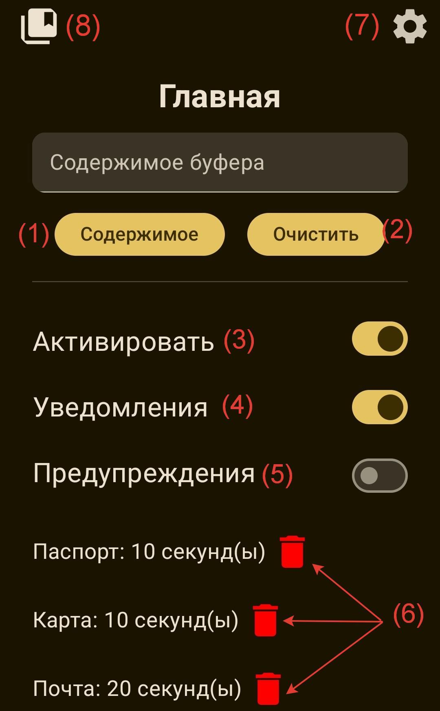
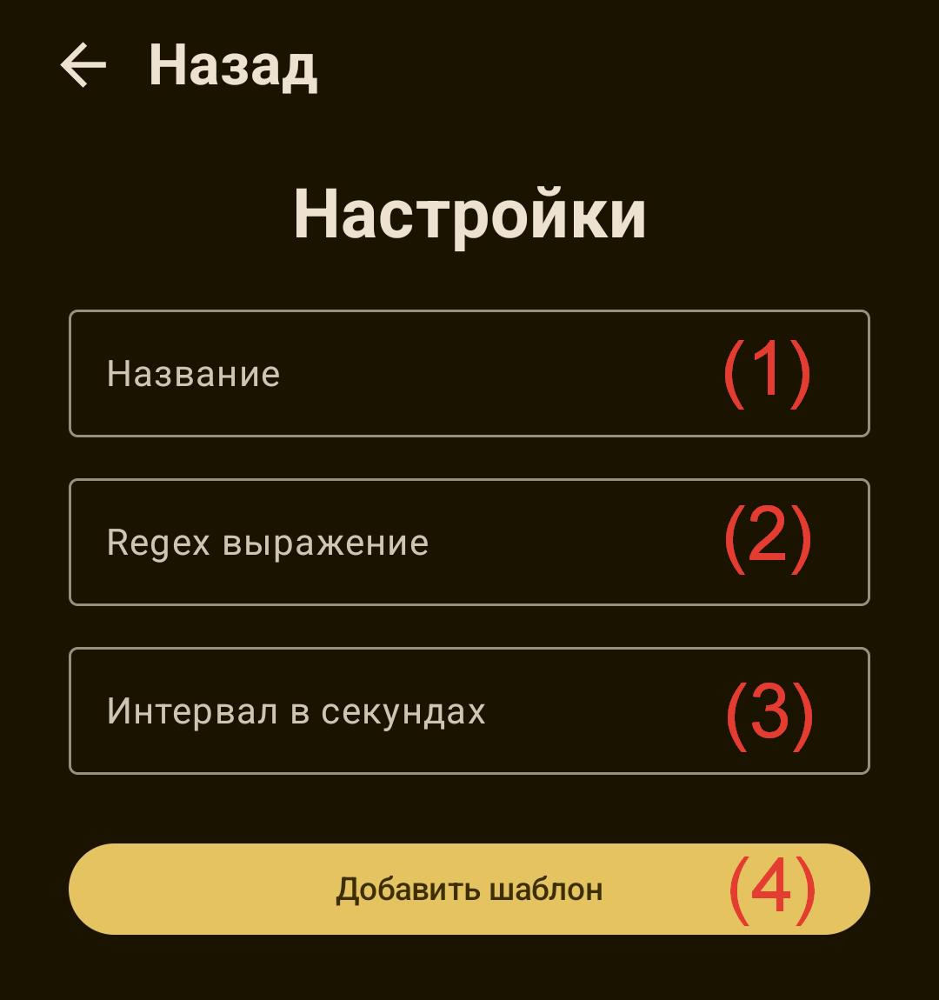
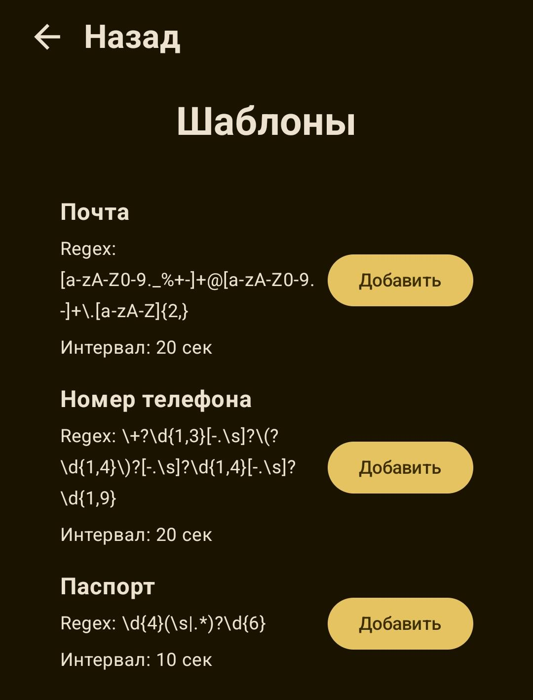

# Инструкция по использованию мобильного приложения

## 1. Установка и первый запуск

- Скачайте приложение из магазина приложений (в будущем) или путём установки загрузочного файла с расширением APK.
- При первом запуске приложение запросит разрешение на уведомления, а также на использование сервиса Accessibility Service. Без разрешений программа не будет функционировать.

## 2. Главный экран

На главном экране представлен следующий функционал:

1. **Просмотр содержимого буфера обмена** и ручная очистка.
2. **Переключатель "Активировать"**: после включения активирует фоновый мониторинг буфера обмена для автоматической очистки в соответствии с правилами очистки.
3. **Переключатель "Уведомления"**: после включения приложение будет уведомлять пользователя о том, сколько осталось до очистки буфера и когда буфер очищен.
4. **Переключатель "Предупреждения"**: после включения будет присылать уведомления пользователю о попадании в буфер обмена типа данных, соответствующего одному из правил очистки.
5. **Список активированных правил** с интервалами очисток. При необходимости можно убрать правило очистки, нажав на иконку "Корзина".
6. **Раздел настроек** и **библиотека шаблонов**.

## 3. Добавление пользовательских правил очистки для технически продвинутых пользователей

Для добавления собственного правила очистки перейдите в раздел настроек из главного экрана и следуйте следующим инструкциям:

1. Введите название правила (например, "Номер паспорта").
2. Вставьте RegEx шаблон (например, `\d{4} \d{6}`).
3. Введите интервал очистки в секундах.
4. Нажмите кнопку "Добавить правило".

Теперь новое правило появится на главном экране в списке активированных.

## 4. Библиотека готовых шаблонов

Для использования уже готовых правил очистки перейдите в раздел "Библиотека шаблонов" из главного экрана и добавьте необходимые вам. Здесь представлены основные типы данных, которые упростят использование приложения для обычного пользователя и помогут уменьшить количество атак несанкционированной утечки конфиденциальной информации из буфера обмена. После добавления правила добавятся в список активированных на главном экране.

## 5. Уведомления и предупреждения 

1. При активации защиты буфера обмена на Android-устройстве будет выведено следующее уведомление о фоновой работе:

2. При активации умных уведомлений при попадании в буфер обмена какой-либо информации будет вестись таймер до момента очистки, а после сообщит о совершенной освобождении буфера.

3. При активированных предупреждениях после попадании в буфер обмена информации, соответствующей одному из правил очистки, приложение отправит уведомление о замеченном типе данных

## 6. Советы при использовании

- Для важных данных (банковские данные, личная и конфиденциальная информация) устанавливайте минимальное время очистки (5–10 сек).
- Регулярно обновляйте список правил.
- Используйте уже готовые шаблоны очисток, так как они пополняются важными для безопасности правилами.
- Не отключайте защиту при работе с конфиденциальной информацией.
- Используйте исключения только для доверенных приложений.

## 7. Устранение неполадок

Если защита не работает:

- Проверьте, выключен ли режим энергосбережения.
- Убедитесь, что приложение имеет разрешение на использование сервиса Accessibility Service.
